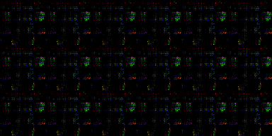
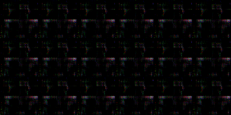
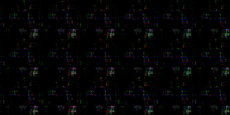

# DSC160 Final Project Group-15

DSC160 Data Science and the Arts - Final Project - Generative Arts - Spring 2020

Project Team Members: 
- Joseph Del Val, jdelval@ucsd.edu
- Nathan Tsai, nhtsai@ucsd.edu
- Jacob Benson, jtbenson@ucsd.edu
- Hanbyul Ryu, h9ryu@ucsd.edu
- Gabriel Zalles, gzalles@ucsd.edu

## Abstract

(10 points) 

Our project is to take a closer look at what artistic features define a group of similar artists or a specific art movement/period. We aim to take groups of artists and their works to train a model and generate a unique result representing the artists. As for our training data to start this project, it will consist of the collected paintings of all of the artists we have in question, such as the works of Dali, Van Gogh, and Picasso. Our result will be a collection of sets of GAN-generated images, each from their particular artist. These sets will ideally each have specific artistic features that define them, thus defining that artist.. We hope to see clear distinctions between the generated images from each artist / movement enough to where one could identify the artist based on the features of the generated image.

There may be some challenges in doing this, however. Many artists may have not composed a large number of paintings, making their works alone quite unsuitable for a training set for a GAN. If we are to combine several artists into one “movement” on which we run the     GAN, this dataset may end up quite heterogeneous. Moreover, some artists have had many distinct periods within their works, which can add some additional heterogeneity to the data. But, overall, this project is culturally interesting because it will reveal to us the discerning features of each art movement. Personally we were interested in what images would be created based on at least a large majority of each artist's complete works, considering each one went through many different phases and styles of work. This project will build off of the GAN material we have already covered in class and on assignment 3, and build off code such as the GAN notebook from class, and the scrape wikiArt notebook from class. 

Inspired by GANGogh: https://github.com/rkjones4/GANGogh

## Data and Model

(10 points) 

In the final submission, this section will describe both the data you use for this project and any pre-existing models/neural nets. For each you should provide the name, a textual description, and a link. If there is a paper (for neural net) link that as well.
### Neural Net
The model is an improved Wasserstein GAN (WGAN) model based on GANGogh model (Jones 2017).
  - [GANGogh by K. Jones 2017](https://github.com/rkjones4/GANGogh)
  - ["GANGogh: Creating Art with GANs"](https://towardsdatascience.com/gangogh-creating-art-with-gans-8d087d8f74a1)

### Training Data
The training data consists of images of artworks by art movement, scraped from WikiArt. The art movements include: Post-Impressionism, Realism (Van Gogh); Surrealism (Dali); and Cubism, Expresionism, and Surrealism (Picasso).

links to data
- [Van Gogh](https://www.wikiart.org/en/vincent-van-gogh/all-works/text-list)
- [Dali](https://www.wikiart.org/en/salvador-dali/all-works/text-list)
- [Picasso](https://www.wikiart.org/en/pablo-picasso/all-works/text-list)

## Code

(20 points)

[Data Acquisition & Web Scraping Code]()
- Uses BeautifulSoup4 to scrape WikiArt artworks by art movement. Scaping the works of each artist should take about an hour, and is saved in a data folder.

[Data Processing]()
- picStuff.py is used to batch process images from wikiart into 64x64 pixel format readily understood by TF. This process is a bit quicker than the data acquisition and saves the new processed images into a folder called small_imagesdata.

[Improved WGAN]()
- Generative model based on GANGogh that generates and classifies artwork by art movement. [From here](https://arxiv.org/pdf/1704.00028.pdf) originally and then modified to create the GANGogh.

[Generative Methods]()
- The TF model outputs images as it evolves. Our model is not converging properly at the moment...😢it is starting to create forms but nothing discernible.  

The original structure of the files as they were run in Datahub may need to be replicated in order for the scripts to run correctly. Specifically, the GanGogh notebook and picstuff notebooks should be in the home directory. Data should be stored in a subfolder data/, and a ‘generated’ folder should be created as well.

## Results

(30 points) 

### Dali

### Picasso

### Van Gogh

The images are still converging towards a real shape that is human-interpretable. Getting the GAN to works took much more work than we anticipated. There are a variety of minute technical errors which accumulate and result in huge delays. Whereas one would expect to simply download the repository, install the dependencies and run the code, it turns out that much can go wrong along the way. Formatting problems, deprecations, syntax, mismatch of versions, multiple references to single namespace, etc. However, we can start to notice some shape developping from our generator. Much like the article, we believe that part of the reason this set did not converge was due to the lack of data which was partly a result of time limitations.  We believe that using a much larger pool of paintings we could still return some interesting images in high quality. As for what we can make of our results, the Picasso image seems to be geometric while the Van Gogh and Dali images look vaguely humanoid.

## Discussion

After running into countless setbacks in the form of DataHub crashes, internet outages, and many Tensorflow errors; we were finally able to get an output from our GAN. Our initial plan was to be able to analyze different aspects of generated works by movement or genre. However, due to our setbacks we were only able to do ___.

This project can be considered culturally innovative as it deals with generating artwork in a similar style to artists that are renowned internationally for their talent. Through this project we are somehow learning from their style and creating another by using the data we have gathered. By doing so there could be a way to understand more about the different art styles and periods that were not evident by simply looking at the art pieces with the human eye. The possibility of being able to potentially compute the difference between the art styles could help reduce some ambiguity among them as well.

Our generative computational approach has a significant difference from traditional art production in that we are actively encouraging the process of 'replication' in our process. While the generated art will in no way be a copy of the artworks, the process involved in generating it is based off of the numerous data gathered by scraping already existent artworks. This could potentially be seen as plagiarism if done by another human being. In addition, the development of how the artwork is created differs as well. While the generative model starts with a basic background while adding the details from a seemingly dark solid space, traditional art production usually starts with some kind of sketch and/or guideline that is representative of the final product.

We aimed to find significant distinctions between generated artworks based on a handful of different notable artists. We wanted to be able to show certain features that would describe certain movements or periods of art. Also, being able to generate art that is in-distinguishable from works by the original artist’s creates a kind of discredibility towards future artworks. Considering we can now create beautiful artworks using computational methods, how are we supposed to judge new art that doesn’t hold up to new standards created by this era of generated art?

One limiting factor of this project was that the generation and download of the generated art took a significant amount of time, especially when trying to take multiple different things into account. Potentially this project could be developed further by looking into how to compress the data to maybe take up less space or be run more efficiently. This problem could also be avoided by adding resources or using a computer with higher storage. Another way to develop this project further would be to develop a system where the generative model could also store the computational and algorithmic differences among the different art styles that it had to analyze. In a similar development, it would also be interesting to see what art can be generated by combining multiple different art styles and intertwining the styles together to create one artwork.

## Team Roles

Provide an account of individual members and their efforts/contributions to the specific tasks you accomplished.

- Joseph Del Val:
- Nathan Tsai: abstract, scraping, discussion
- Jacob Benson: abstract, presentation, data scraping and processing, discussion
- Hanbyul Ryu: 
- Gabriel Zalles: presentation, discussion, wiki 

## Technical Notes and Dependencies

Any implementation details or notes we need to repeat your work. 
- Additional libraries you are using for this project.  

TF, BeautifulSoup, etc. all other libraries get imported by our code. As long as you install TF correctly it should be fine. [here is an example](https://www.pugetsystems.com/labs/hpc/The-Best-Way-to-Install-TensorFlow-with-GPU-Support-on-Windows-10-Without-Installing-CUDA-1187/)

- Does this code require other pip packages, software, etc?

DataHub is recommended. 

- Does this code need to run on some other (non-datahub) platform? (CoLab, etc.)

No.

## Reference

All references to papers, techniques, previous work, repositories you used should be collected at the bottom:
- Papers
- [GANGogh Repository (Jones 2017)](https://github.com/rkjones4/GANGogh)
- ["GANGogh: Creating Art with GANs" (Jones 2017)](https://towardsdatascience.com/gangogh-creating-art-with-gans-8d087d8f74a1)
